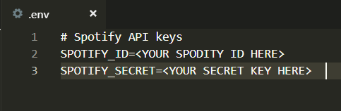
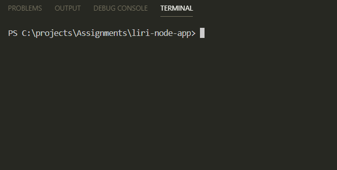
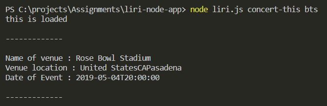
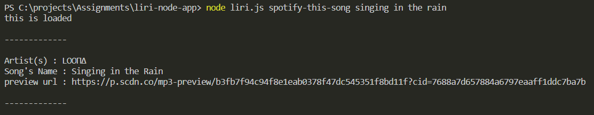
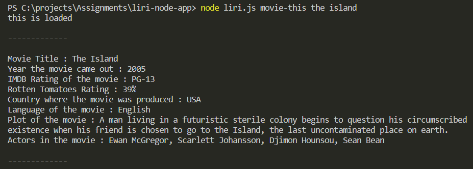
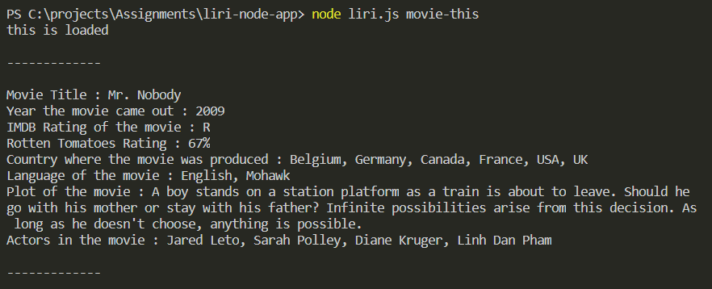
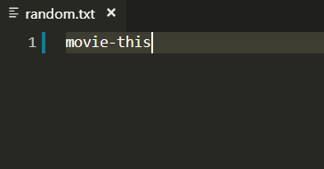
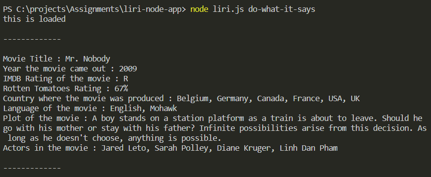

# LIRI BOT

The user can access various information based on the type of commend they input.
*API referenced in this project:*
* Bands in Town
* Spotify
* IMDB


### Prerequisites

You will need your own spofity key and secret to input in an .env file



## Getting Started

To access the LIRI BOT, download the package and open the Terminal

Navigate towards the appropriate folder by using cd commands:




The following command input will respond with the following API

**Bands in Town**
```
node liri.js concert-this <artist/band name here>  
```

This would be the results:




**Spotify**
```
node liri.js spotify-this-song '<song name here>' 
```

This would be the results:



**IMDB**
```
node liri.js movie-this '<movie name here>' 
```
This would be the results:



NOTE:  If the user does not enter a movie name, the default movie searched will be Mr. Nobody

This would be the results:



**do-what-it-says** 
the command will take the text inside of random.txt and then use it to call one of LIRI's commands.

```
node liri.js do=what-it-says 
```

The text file referenced




The result in the terminal



## Video Demonstration

(https://drive.google.com/file/d/1SLDawY40DxncYyKjV9n-unL5caId0WL3/view)


## Authors

* **Tiffany Lin** 

See also the list of [contributors](https://github.com/your/project/contributors) who participated in this project.

## License

This project is licensed under the MIT License - see the [LICENSE.md](LICENSE.md) file for details

## Acknowledgments

* Adrian for trouble-shooting
